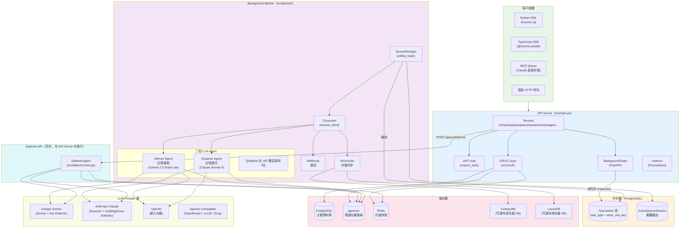

# ARCHITECTURE.md — Honcho 系統架構

> 基於 Honcho v3.0.5 | 參考來源：entry_points.md + core_logic.md + extensions.md

---

## 1. 高層次架構圖



---

## 2. 元件職責清單

| 元件 | 位置 | 職責 |
|------|------|------|
| **FastAPI App** | `src/main.py` | HTTP 路由掛載、middleware 初始化、lifespan 管理（telemetry/cache/DB） |
| **Routers** | `src/routers/` | 端點定義、路徑參數解析、依賴注入（auth + DB）、HTTP 回應格式化 |
| **Security** | `src/security.py` | JWT 建立/驗證、`require_auth()` 依賴工廠（workspace/peer/session 範圍） |
| **CRUD Layer** | `src/crud/` | 所有資料庫操作（讀/寫/刪），封裝 SQLAlchemy 查詢 |
| **QueueManager** | `src/deriver/queue_manager.py` | PostgreSQL 輪詢、work_unit_key 分組、ActiveQueueSession 樂觀鎖、asyncio Task 管理 |
| **Consumer** | `src/deriver/consumer.py` | 任務類型路由（representation / summary / dream / deletion / webhook / reconciler） |
| **Deriver** | `src/deriver/deriver.py` | 批次訊息處理、呼叫 LLM 擷取明確觀察記錄、排程 dream |
| **Dreamer** | `src/dreamer/orchestrator.py` | Dream 週期協調：Surprisal 採樣 → Deduction Specialist → Induction Specialist |
| **DialecticAgent** | `src/dialectic/core.py` | 工具迭代循環、推理等級選擇、自然語言回應合成 |
| **Agent Tools** | `src/utils/agent_tools.py` | 共用工具定義（11 個工具）+ `create_tool_executor()` 工廠 |
| **LLM Client** | `src/utils/clients.py` | 多 provider 統一介面、工具呼叫循環、備用 provider 切換 |
| **RepresentationManager** | `src/crud/representation.py` | 觀察記錄管理、語義搜尋、最高引用記錄取得 |
| **Vector Store** | `src/vector_store/` | 可插拔向量儲存 ABC + pgvector/Turbopuffer/LanceDB 實作 |
| **Reconciler** | `src/reconciler/` | pgvector → 外部向量儲存異步同步 |
| **EmbeddingClient** | `src/embedding_client.py` | 批次嵌入生成（OpenAI / Gemini / OpenRouter），最多 300K tokens/請求 |
| **Surprisal** | `src/dreamer/surprisal.py` | 幾何驚訝度計算（kNN 樹），識別需要重新探索的觀察記錄 |
| **Cache** | `src/cache/client.py` | Redis 快取（cashews），降級為 no-op（若 CACHE_ENABLED=false） |
| **Telemetry** | `src/telemetry/` | CloudEvents 批次發送、Prometheus 指標、Langfuse LLM 追蹤、Sentry 錯誤 |

---

## 3. 分層設計與模組邊界

```
┌─────────────────────────────────────────────────────────────┐
│                    HTTP Interface Layer                       │
│  src/routers/ ← 僅處理 HTTP 協議轉換，不含業務邏輯           │
├─────────────────────────────────────────────────────────────┤
│                    Business Logic Layer                       │
│  src/dialectic/  ← Dialectic 查詢邏輯                       │
│  src/deriver/    ← 記憶擷取邏輯                              │
│  src/dreamer/    ← 記憶整合邏輯                              │
├─────────────────────────────────────────────────────────────┤
│                    Data Access Layer                          │
│  src/crud/  ← 所有 DB 操作集中在此，不在 Router 直接查詢     │
├─────────────────────────────────────────────────────────────┤
│                    Infrastructure Layer                       │
│  src/db.py         ← 連線池管理                              │
│  src/models.py     ← ORM 模型                                │
│  src/vector_store/ ← 向量儲存抽象                            │
│  src/cache/        ← 快取抽象                                │
│  src/telemetry/    ← 可觀測性                                │
└─────────────────────────────────────────────────────────────┘
```

**關鍵邊界規則**：

1. **Router 不直接操作 DB** — 所有 DB 存取透過 `src/crud/` 進行
2. **CRUD 不呼叫 LLM** — LLM 呼叫只在 `deriver/`, `dreamer/`, `dialectic/` 中
3. **不在外部呼叫期間持有 DB session** — 所有 LLM/embedding/HTTP 呼叫前必須關閉 DB session

---

## 4. 通訊模式

### 4.1 同步路徑（HTTP 請求-回應）

```
客戶端 → FastAPI Router → CRUD → PostgreSQL
                              ↓
                        返回 HTTP 回應
```

大多數資源操作（CRUD）是同步的，DB 操作完成即可回應。

### 4.2 非同步路徑（背景處理）

```
客戶端 → POST /messages
              ↓
         FastAPI BackgroundTasks（非阻塞）
              ↓
         enqueue() → QueueItem INSERT
              ↓ [HTTP 201 立即回應]

         [別的行程]
         QueueManager.polling_loop()
              ↓（每 1 秒輪詢）
         取出 QueueItem → 分派給 Consumer
              ↓
         Deriver Agent → observations → documents
```

### 4.3 串流路徑（SSE）

```
客戶端 → POST /peers/{id}/chat?stream=true
              ↓
         StreamingResponse（Server-Sent Events）
              ↓
         DialecticAgent.answer_stream()
              ↓（工具迭代 + LLM 串流）
         yield token chunks → 客戶端即時接收
```

### 4.4 Dream 排程路徑

```
Deriver 處理完 → document 計數 ≥ DOCUMENT_THRESHOLD
                          ↓
              DreamScheduler.schedule_dream()
                          ↓（等待 60 分鐘空閒）
              enqueue_dream() → QueueItem INSERT
                          ↓
              QueueManager → Consumer → run_dream()
                          ↓
              Surprisal → Deduction → Induction
```

---

## 5. 核心設計決策

### 決策 1：PostgreSQL 作為 Message Queue

**動機**：避免引入外部 message queue（Kafka/RabbitMQ/SQS）的複雜度和部署依賴。

**實作**：
- `QueueItem` 表存儲所有異步任務
- `ActiveQueueSession` 表實現樂觀鎖定（`ON CONFLICT DO NOTHING`）
- `work_unit_key` 確保同一上下文的任務有序處理

**取捨**：適合中等負載；若需要高吞吐量，可替換為外部 queue。

### 決策 2：Peer 統一模型

**動機**：打破 User-Assistant 二元範式，讓任何實體（人類、AI、NPC、API）都是平等的「Peer」。

**實作**：
- `Peer` 表統一表示所有參與者
- `SessionPeer` 關聯表儲存 observe_me / observe_others 設定
- Observer/Observed 語義：Collection 屬於 observer peer（觀察者視角的知識庫）

### 決策 3：三段分離的記憶流水線

```
訊息 → Deriver（明確擷取，即時）
              ↓
       documents（明確觀察記錄）
              ↓
       Dreamer（整合推論，延遲）
              ↓
       documents（演繹+歸納觀察記錄）
              ↓
       Dialectic（查詢，隨需）
```

**動機**：分離關注點，Deriver 快速處理，Dreamer 在低峰期深度處理，各自獨立優化。

### 決策 4：五層推理等級（Dialectic）

**動機**：不同查詢場景需要不同的成本/品質取捨。

| 等級 | 成本 | 延遲 | 適用場景 |
|------|------|------|---------|
| minimal | 最低 | ~100ms | 快速推薦、autocomplete |
| low | 低 | ~500ms | 一般個人化 |
| medium | 中 | ~1s | 情感感知對話 |
| high | 高 | ~2s | 複雜心理分析 |
| max | 最高 | ~3-5s | 深度推理、治療應用 |

### 決策 5：不在外部呼叫期間持有 DB Session

**動機**：LLM 呼叫可能需要 5-30 秒，持有 DB 連線期間等待會耗盡連線池。

**模式**：
```python
# Phase 1: 短暫 DB session
async with tracked_db("preflight") as db:
    config = get_configuration(...)
    peer_card = await crud.get_peer_card(db, ...)
# ← session 關閉

# Phase 2: LLM 呼叫（無 DB 連線）
result = await llm_call(...)
```

---

## 6. 核心流程序列圖

### 6.1 訊息建立 → 記憶形成

```
客戶端               API Server          PostgreSQL           Deriver Worker
   |                     |                    |                      |
   |--POST /messages---->|                    |                      |
   |                     |--INSERT messages-->|                      |
   |                     |<---message IDs-----|                      |
   |                     |--INSERT embeddings>|                      |
   |                     |--BackgroundTask----|---enqueue()--------->|
   |<----201 Created-----|                    |                      |
   |                     |                    |<--INSERT QueueItem---|
   |                     |                    |                      |
   |                    [幾秒後，背景處理]     |                      |
   |                     |                    |<--poll QueueItem-----|
   |                     |                    |--QueueItem rows----->|
   |                     |                    |                      |--Gemini LLM call-->
   |                     |                    |                      |<--observations----
   |                     |                    |<--INSERT documents---|
   |                     |                    |<--UPDATE QueueItem---|
```

### 6.2 Dialectic 查詢

```
客戶端               API Server          PostgreSQL/Redis       Anthropic/Gemini
   |                     |                    |                      |
   |--POST /chat-------->|                    |                      |
   |                     |--[DB] get config-->|                      |
   |                     |--[DB] get peer_card|                      |
   |                     |--[DB session close]|                      |
   |                     |                    |                      |
   |                     |--DialecticAgent.answer()                  |
   |                     |        |--search_memory()-->|             |
   |                     |        |<--observations-----|             |
   |                     |        |                                  |
   |                     |        |--LLM call---------------------------->
   |                     |        |<--tool_calls--------------------------
   |                     |        |--[repeat until no tool calls]    |
   |                     |        |--final LLM call--------------------->
   |                     |        |<--response----------------------------
   |                     |                    |                      |
   |<----200 + answer----|                    |                      |
```

---

## 7. 可觀測性架構

```
                    ┌──────────────────────┐
                    │   Honcho Application │
                    └──────────┬───────────┘
                               │
           ┌───────────────────┼───────────────────┐
           ▼                   ▼                   ▼
    ┌─────────────┐   ┌──────────────┐   ┌──────────────┐
    │   Sentry    │   │   Langfuse   │   │  Prometheus  │
    │ 錯誤追蹤    │   │  LLM 追蹤   │   │  指標收集    │
    │ (push)      │   │  (push)      │   │  (pull)      │
    └─────────────┘   └──────────────┘   └──────────────┘
           
           ┌───────────────────────────────────────┐
           │      CloudEvents Telemetry            │
           │  批次 HTTP POST → 分析端點             │
           │  (AgentToolConclusionsCreatedEvent等)  │
           └───────────────────────────────────────┘
```

所有可觀測性整合均可透過設定完全停用，系統繼續正常運行。
