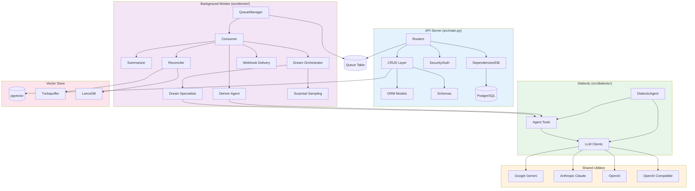

# CODEBASE_MAP.md — Honcho 程式碼地圖

## 目錄結構總覽（Annotated）

```
honcho/
├── src/                          # 🎯 核心 API server
│   ├── main.py                   # FastAPI 應用程式工廠 + middleware + 路由掛載
│   ├── config.py                 # 設定管理（pydantic-settings + TOML）
│   ├── models.py                 # SQLAlchemy ORM 模型（所有資料表定義）
│   ├── db.py                     # DB engine + sessionmaker
│   ├── dependencies.py           # FastAPI 依賴（get_db, tracked_db）
│   ├── exceptions.py             # 自訂例外類型
│   ├── security.py               # JWT 認證（create/verify/require_auth）
│   ├── embedding_client.py       # 嵌入向量生成客戶端
│   │
│   ├── schemas/                  # Pydantic I/O 驗證模型
│   │   ├── api.py               # 公開 API 的 Request/Response schema
│   │   ├── configuration.py     # 設定相關 schema
│   │   └── internal.py          # 內部使用 schema
│   │
│   ├── crud/                     # 資料庫 CRUD 操作層
│   │   ├── workspace.py         # Workspace 增刪改查
│   │   ├── peer.py              # Peer 增刪改查
│   │   ├── session.py           # Session 增刪改查（含 peers 關聯）
│   │   ├── message.py           # Message 增刪改查（含嵌入 + token 計算）
│   │   ├── collection.py        # Collection 管理
│   │   ├── document.py          # Document (Observation) 管理
│   │   ├── deriver.py           # Deriver 相關的 DB 操作
│   │   ├── peer_card.py         # Peer card 存取
│   │   ├── representation.py    # RepresentationManager（取得工作表示）
│   │   └── webhook.py           # Webhook 端點管理
│   │
│   ├── routers/                  # API 路由處理器
│   │   ├── workspaces.py        # GET/POST /workspaces, /workspaces/search
│   │   ├── peers.py             # GET/POST /peers, /chat, /representation, /card, /context
│   │   ├── sessions.py          # GET/POST /sessions, /context, /clone
│   │   ├── messages.py          # GET/POST /messages, /upload
│   │   ├── conclusions.py       # GET /conclusions（搜尋觀察記錄）
│   │   ├── keys.py              # POST /keys（建立 scoped JWT）
│   │   └── webhooks.py          # GET/POST /webhooks
│   │
│   ├── deriver/                  # 背景記憶擷取系統
│   │   ├── __main__.py          # 進程入口（uvloop + asyncio.run）
│   │   ├── queue_manager.py     # QueueManager 主循環（輪詢 + worker 管理）
│   │   ├── consumer.py          # 任務路由器（representation/summary/dream/...）
│   │   ├── deriver.py           # 記憶擷取批次處理（呼叫 LLM agent）
│   │   ├── enqueue.py           # 訊息入佇列邏輯
│   │   └── prompts.py           # Deriver agent 系統提示詞
│   │
│   ├── dialectic/                # Dialectic 查詢系統
│   │   ├── chat.py              # agentic_chat() / agentic_chat_stream() 入口
│   │   ├── core.py              # DialecticAgent 類別（工具迭代循環）
│   │   └── prompts.py           # Dialectic agent 提示詞
│   │
│   ├── dreamer/                  # 記憶整合系統
│   │   ├── orchestrator.py      # run_dream()（協調 specialists）
│   │   ├── specialists.py       # DeductionSpecialist + InductionSpecialist
│   │   ├── dream_scheduler.py   # DreamScheduler（空閒排程）
│   │   ├── surprisal.py         # 幾何驚訝度採樣
│   │   └── trees/               # ANN 樹演算法（kdtree/balltree/rptree/...）
│   │
│   ├── reconciler/               # 向量儲存同步
│   │   ├── scheduler.py         # ReconcilerScheduler（週期排程）
│   │   ├── sync_vectors.py      # 同步 pending 嵌入到外部向量 DB
│   │   └── queue_cleanup.py     # 清理舊佇列記錄
│   │
│   ├── vector_store/             # 可插拔向量儲存後端
│   │   ├── __init__.py          # VectorStore ABC + get_external_vector_store()
│   │   ├── turbopuffer.py       # Turbopuffer 後端
│   │   ├── lancedb.py           # LanceDB 後端
│   │   └── utils.py             # upsert_with_retry（tenacity）
│   │
│   ├── cache/                    # Redis 快取
│   │   └── client.py            # cashews init_cache / close_cache
│   │
│   ├── telemetry/                # 可觀測性基礎設施
│   │   ├── logging.py           # 效能指標 + Langfuse 整合
│   │   ├── emitter.py           # CloudEvents 批次發送器
│   │   ├── metrics_collector.py # 本地指標收集
│   │   ├── prometheus/          # Prometheus 指標定義
│   │   ├── events/              # CloudEvents 事件類型定義
│   │   ├── reasoning_traces.py  # LLM 推理追蹤（JSONL）
│   │   └── sentry.py            # Sentry 初始化
│   │
│   ├── utils/                    # 共用工具函式
│   │   ├── agent_tools.py       # 三個 Agent 的工具定義 + create_tool_executor()
│   │   ├── clients.py           # honcho_llm_call()（多 provider 統一介面）
│   │   ├── search.py            # 混合搜尋（向量 + 全文）
│   │   ├── summarizer.py        # Session 摘要（短摘 20 條 / 長摘 60 條）
│   │   ├── formatting.py        # 訊息格式化
│   │   ├── representation.py    # Representation / ObservationMetadata 類別
│   │   ├── tokens.py            # token 計算（tiktoken）
│   │   ├── types.py             # 型別別名（TaskType、DocumentLevel 等）
│   │   ├── config_helpers.py    # get_configuration()（設定繼承解析）
│   │   ├── filter.py            # 查詢過濾器
│   │   ├── files.py             # 檔案上傳處理（PDF 等）
│   │   ├── json_parser.py       # LLM JSON 輸出修復
│   │   ├── queue_payload.py     # 佇列 payload 模型
│   │   └── work_unit.py         # work_unit_key 建構與解析
│   │
│   └── webhooks/                 # Webhook 系統
│       ├── events.py            # QueueEmptyEvent 等事件定義
│       └── webhook_delivery.py  # HTTP 遞送邏輯（含 HMAC 簽名）
│
├── sdks/                         # 客戶端 SDK
│   ├── python/                  # Python SDK（honcho-ai PyPI 套件）
│   │   └── src/honcho/          # SDK 核心
│   └── typescript/              # TypeScript SDK（@honcho-ai/sdk npm 套件）
│       └── src/                 # SDK 核心
│
├── migrations/                   # Alembic 資料庫遷移
│   └── versions/                # 遷移腳本（歷史記錄）
│
├── docs/                         # 官方文件（Mintlify）
│   ├── v1/, v2/, v3/            # 各版本文件（v3 為最新）
│   └── images/                  # 文件圖片
│
├── tests/                        # 測試套件
│   ├── conftest.py              # Pytest fixtures（DB、client 等）
│   ├── alembic/                 # Migration 測試
│   └── bench/                   # 基準測試
│
├── examples/                     # 整合範例
│   ├── crewai/                  # CrewAI 框架整合
│   ├── langgraph/               # LangGraph 框架整合
│   ├── gmail/                   # Gmail 整合
│   └── zo/                      # 示範 agent（Zo）
│
├── mcp/                          # MCP Server
│   └── src/tools/               # MCP 工具（供 Claude 等 AI 直接呼叫）
│
├── database/                     # 資料庫設定（初始化腳本）
├── scripts/                      # 工具腳本（生成 JWT 金鑰等）
├── docker/                       # Docker 設定（入口腳本等）
│
├── pyproject.toml                # Python 專案設定 + 依賴
├── config.toml.example           # 完整設定範本（含所有選項說明）
├── .env.template                 # 環境變數範本
├── alembic.ini                   # Alembic 遷移設定
├── Dockerfile                    # 容器建置
├── docker-compose.yml.example    # 本地 Docker 環境模板
└── fly.toml                      # Fly.io 部署設定
```

---

## 「我想改 X 要看哪裡？」

| 我想要... | 看這裡 | 關鍵檔案 |
|-----------|--------|---------|
| 新增一個 API endpoint | `src/routers/` | 選擇對應的 router 檔案 |
| 修改資料庫模型 | `src/models.py` | 再建立 migration：`alembic revision --autogenerate -m "描述"` |
| 修改 API 輸入輸出格式 | `src/schemas/api.py` | Pydantic schema 定義 |
| 修改 CRUD 邏輯 | `src/crud/` | 對應資源的 crud 檔案 |
| 調整 Deriver（記憶擷取）行為 | `src/deriver/deriver.py` | 批次處理邏輯 |
| 修改 Deriver 提示詞 | `src/deriver/prompts.py` | 系統提示詞 |
| 修改 Dialectic（查詢）行為 | `src/dialectic/core.py` | DialecticAgent 類別 |
| 修改 Dialectic 提示詞 | `src/dialectic/prompts.py` | 系統提示詞 |
| 修改 Dream（記憶整合）行為 | `src/dreamer/orchestrator.py` | Dream 週期協調 |
| 修改 Dream specialists | `src/dreamer/specialists.py` | 演繹/歸納 specialist |
| 新增 Agent 工具 | `src/utils/agent_tools.py` | TOOLS dict + executor |
| 切換 LLM provider | `config.toml` / `.env` | 設定 DERIVER_PROVIDER 等 |
| 新增向量儲存後端 | `src/vector_store/` | 繼承 `VectorStore` ABC |
| 修改佇列處理邏輯 | `src/deriver/queue_manager.py` | QueueManager 類別 |
| 修改設定系統 | `src/config.py` | 對應的 Settings 類別 |
| 新增 webhook 事件 | `src/webhooks/events.py` | 事件類別定義 |
| 修改認證邏輯 | `src/security.py` | JWT create/verify/require_auth |
| 新增遙測事件 | `src/telemetry/events/` | 事件類別 + `emit()` 呼叫 |
| 修改 Surprisal 採樣 | `src/dreamer/surprisal.py` + `src/dreamer/trees/` | 採樣演算法 |
| 修改向量同步邏輯 | `src/reconciler/sync_vectors.py` | 同步循環 |
| 修改訊息搜尋 | `src/utils/search.py` | 混合搜尋實作 |
| 修改摘要觸發邏輯 | `src/deriver/enqueue.py:329-337` | 摘要觸發條件（每 20/60 條）|
| 調整連線池 | `.env` / `config.toml` [db] | DB_POOL_SIZE 等 |
| 修改快取策略 | `src/cache/client.py` | cashews 設定 |
| 調試資料庫查詢 | 設定 `DB_SQL_DEBUG=true` | 輸出所有 SQL |

---

## 模組依賴關係圖



---

## 關鍵設計邊界

### 規則：不在外部呼叫期間持有 DB session

這是 Honcho 最重要的設計規則（`CLAUDE.md` 明確要求）：

```python
# ✅ 正確做法：先完成外部呼叫，再開始 DB 操作
async def agentic_chat(...):
    # Phase 1: 短暫 DB session 取得設定
    async with tracked_db("dialectic.preflight") as db:
        configuration = get_configuration(None, session, workspace)
        peer_card = await crud.get_peer_card(db, ...)
    # DB session 關閉 ↑

    # Phase 2: LLM 呼叫（無 DB session，可能需要數秒）
    agent = DialecticAgent(...)
    return await agent.answer(query)

# ❌ 錯誤做法：在 LLM 呼叫期間持有 DB session
async def bad_example(db: AsyncSession):
    config = await crud.get_something(db)
    result = await llm_call(...)  # 佔用 DB 連線！
    await crud.save(db, result)
```

### 規則：使用 tracked_db 而非直接 SessionLocal

`tracked_db` 自動設定 `request_context`（用於 DB tracing）並確保非同步安全的事務清理。
