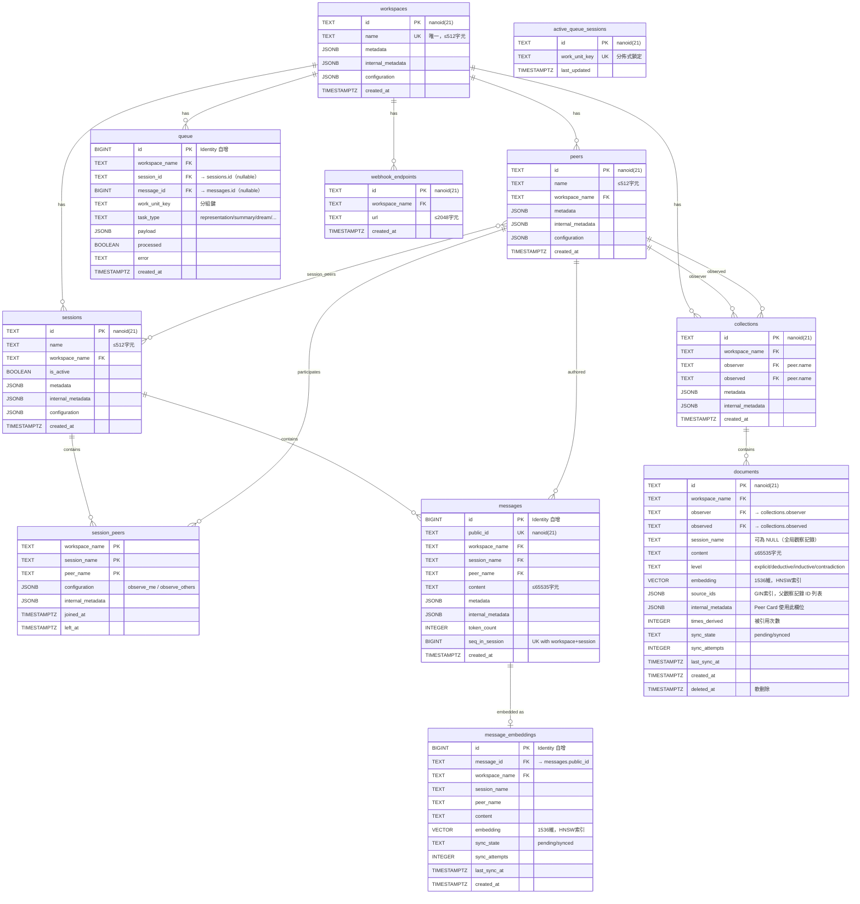

# DATA_MODEL.md — Honcho 資料模型

> 基於 Honcho v3.0.5 | 參考來源：src/models.py + data_flow.md + core_logic.md

---

## 1. ER 圖（Entity-Relationship Diagram）



---

## 2. 各資料表詳細說明

### 2.1 Workspace（工作空間）

最高層級的隔離單位，對應不同應用程式。

```python
# src/models.py:94-123
class Workspace(Base):
    __tablename__ = "workspaces"
    id: str               # nanoid(21)，正則 [A-Za-z0-9_-]{21}
    name: str             # 全局唯一，≤512 字元，作為 FK 使用
    configuration: dict   # Workspace 級設定（所有 peers 的預設值）
    metadata: dict        # 用戶自訂元資料
    internal_metadata: dict  # 系統內部使用
```

**注意**：`name`（非 `id`）作為外鍵，因此各實體透過 `workspace_name` 關聯。

---

### 2.2 Peer（參與者）

表示任何參與者：人類用戶或 AI agent，統一模型。

```python
# src/models.py:126-161
class Peer(Base):
    __tablename__ = "peers"
    id: str               # nanoid(21)
    name: str             # workspace 內唯一（UK: name + workspace_name）
    workspace_name: str   # FK → workspaces.name
    configuration: dict   # Peer 個人設定（observe_me、reasoning、dream 等）
    metadata: dict        # 用戶自訂元資料
```

**configuration 欄位結構**（`src/schemas/configuration.py`）：
```json
{
  "observe_me": true,
  "reasoning": { "enabled": true },
  "summary": { "enabled": true },
  "dream": { "enabled": true },
  "peer_card": { "use": true }
}
```

---

### 2.3 Session（對話上下文）

承載多個 Peer 之間的對話。

```python
# src/models.py:163-199
class Session(Base):
    __tablename__ = "sessions"
    id: str               # nanoid(21)
    name: str             # workspace 內唯一（UK: name + workspace_name）
    workspace_name: str   # FK → workspaces.name
    is_active: bool       # 是否活躍（預設 true）
    configuration: dict   # Session 級設定（覆蓋 workspace 設定）
```

---

### 2.4 SessionPeer（多對多關聯表）

```python
# src/models.py:38-90（Table 定義）
session_peers_table:
    workspace_name: str   # PK
    session_name: str     # PK（FK → sessions）
    peer_name: str        # PK（FK → peers）
    configuration: dict   # observe_me / observe_others（此 session 的覆蓋設定）
    joined_at: datetime   # 加入時間
    left_at: datetime?    # 離開時間（None 表示仍在 session 中）
```

**configuration.observe_me**：此 peer 在此 session 中是否允許被其他 peer 觀察。
**configuration.observe_others**：此 peer 在此 session 中是否觀察其他 peer。

---

### 2.5 Message（訊息）

對話中的原子資料單元。

```python
# src/models.py:202-271
class Message(Base):
    __tablename__ = "messages"
    id: int               # BigInteger Identity（內部主鍵，不暴露給 API）
    public_id: str        # nanoid(21)（API 使用此 ID）
    workspace_name: str   # 複合 FK → workspaces
    session_name: str     # 複合 FK → sessions
    peer_name: str        # 複合 FK → peers（訊息作者）
    content: str          # 訊息內容（≤65535 字元）
    token_count: int      # tiktoken 計算的 token 數
    seq_in_session: int   # session 內的順序號（BigInteger）
    metadata: dict        # 用戶元資料
```

**索引**：
- `ix_messages_session_lookup`：複合索引（session_name, id）
- `ix_messages_content_gin`：GIN 全文索引（`to_tsvector('english', content)`）
- UK constraint：`(workspace_name, session_name, seq_in_session)`

---

### 2.6 MessageEmbedding（訊息嵌入向量）

1:1 對應 Message，儲存向量表示。

```python
# src/models.py:273-328
class MessageEmbedding(Base):
    __tablename__ = "message_embeddings"
    id: int               # BigInteger Identity
    message_id: str       # FK → messages.public_id（CASCADE DELETE）
    embedding: Vector(1536)  # 嵌入向量（HNSW 索引，cosine ops）
    sync_state: str       # "pending" | "synced"
    sync_attempts: int    # 同步嘗試次數
    last_sync_at: datetime?  # 上次同步時間
```

**HNSW 索引參數**：m=16, ef_construction=64, cosine_ops

---

### 2.7 Collection（觀察集合）

一個 Peer 對另一個 Peer 的觀察記錄集合，三元組唯一。

```python
# src/models.py:331-372
class Collection(Base):
    __tablename__ = "collections"
    id: str               # nanoid(21)
    workspace_name: str   # FK → workspaces
    observer: str         # FK → peers.name（觀察者）
    observed: str         # FK → peers.name（被觀察者）
```

**UK constraint**：`(observer, observed, workspace_name)` — 每對 observer/observed 只有一個 Collection。

**自我觀察**：若 `observer == observed`，表示 Peer 觀察自己。

---

### 2.8 Document（觀察記錄）

核心記憶單元，儲存 LLM 生成的觀察。

```python
# src/models.py:375-471
class Document(Base):
    __tablename__ = "documents"
    id: str               # nanoid(21)
    workspace_name: str   # FK → workspaces
    observer: str         # 複合 FK → collections
    observed: str         # 複合 FK → collections
    session_name: str?    # 來源 session（NULL = 全局觀察記錄）
    content: str          # 觀察記錄內容（≤65535 字元）
    level: str            # "explicit" | "deductive" | "inductive" | "contradiction"
    embedding: Vector(1536)  # 嵌入向量（HNSW 索引）
    source_ids: list[str]?   # 來源 Document ID（GIN 索引）
    internal_metadata: dict  # Peer Card 數據儲存在此欄位
    times_derived: int    # 被引用次數（越高越重要）
    sync_state: str       # "pending" | "synced"
    deleted_at: datetime?  # 軟刪除時間（NULL = 未刪除）
```

**索引**：
- `ix_documents_embedding_hnsw`：HNSW 向量索引
- `ix_documents_source_ids_gin`：GIN 索引（tree traversal）
- `ix_documents_sync_state_last_sync_at`：Reconciler 查詢用

**觀察記錄層級語義**：
- `explicit`：從對話訊息直接擷取的事實（Deriver 產生）
- `deductive`：從明確事實邏輯推導的結論（Dream Deduction Specialist 或 Dialectic 產生）
- `inductive`：跨多個觀察記錄發現的模式和趨勢（Dream Induction Specialist 產生）
- `contradiction`：觀察記錄間的矛盾（Deriver 或 Dream 識別）

---

### 2.9 QueueItem（任務佇列）

PostgreSQL 替代外部 Message Queue。

```python
# src/models.py:473-529
class QueueItem(Base):
    __tablename__ = "queue"
    id: int               # BigInteger Identity（自增，順序保證）
    workspace_name: str?  # FK → workspaces（nullable）
    session_id: str?      # FK → sessions.id（nullable）
    message_id: int?      # FK → messages.id（nullable）
    work_unit_key: str    # 分組鍵（決定處理順序）
    task_type: str        # "representation" | "summary" | "dream" | ...
    payload: dict         # 任務資料（JSONB）
    processed: bool       # 是否已處理（預設 false）
    error: str?           # 錯誤訊息
    created_at: datetime
```

**Partial Unique Indexes（防止重複任務）**：
```sql
-- dream 任務去重
CREATE UNIQUE INDEX ON queue (work_unit_key)
  WHERE task_type = 'dream' AND processed = false;

-- reconciler 任務去重
CREATE UNIQUE INDEX ON queue (work_unit_key)
  WHERE task_type = 'reconciler' AND processed = false;
```

---

### 2.10 ActiveQueueSession（分佈式鎖）

追蹤哪個 work_unit_key 正在被哪個 worker 處理。

```python
# src/models.py:532-542
class ActiveQueueSession(Base):
    __tablename__ = "active_queue_sessions"
    id: str               # nanoid(21)
    work_unit_key: str    # UK — 確保同一 work_unit_key 不被兩個 worker 同時處理
    last_updated: datetime
```

**樂觀鎖邏輯**：
```sql
INSERT INTO active_queue_sessions (work_unit_key, ...)
ON CONFLICT DO NOTHING
-- 若插入成功，此 worker 獲得鎖定
-- 若失敗（已存在），此 work_unit 被其他 worker 處理中，跳過
```

---

### 2.11 WebhookEndpoint（Webhook 端點）

```python
# src/models.py:545-563
class WebhookEndpoint(Base):
    __tablename__ = "webhook_endpoints"
    id: str               # nanoid(21)
    workspace_name: str   # FK → workspaces.name
    url: str              # Webhook URL（≤2048 字元）
    created_at: datetime
```

---

## 3. work_unit_key 格式規範

```
representation:{workspace_name}:{session_name}:{observed}
summary:{workspace_name}:{session_name}
dream:{workspace_name}:{observer}:{observed}
deletion:{workspace_name}:{resource_id}
reconciler:{type}
webhook:{workspace_name}:{url_hash}
```

**用途**：同一 `work_unit_key` 的任務按 `id`（BigInteger）順序執行，確保記憶處理的因果順序。

---

## 4. 資料生命週期

### 4.1 Message 建立流程

```
POST /messages
  ↓
messages 表（INSERT）
  ├─ tiktoken 計算 token_count
  ├─ seq_in_session 遞增分配
  └─ public_id = nanoid(21)

message_embeddings 表（INSERT）
  ├─ embedding = OpenAI text-embedding-3-small
  ├─ sync_state = "pending"（尚未同步到外部向量 DB）
  └─ content = 訊息內容副本

queue 表（INSERT）
  ├─ task_type = "representation"
  ├─ work_unit_key = "representation:{ws}:{session}:{observed}"
  └─ payload = 訊息摘要
```

### 4.2 Document（觀察記錄）建立流程

```
Deriver Agent 執行
  ↓
create_observations() 工具呼叫
  ↓
documents 表（INSERT）
  ├─ level = "explicit" / "deductive"
  ├─ embedding = 嵌入向量
  ├─ sync_state = "pending"
  ├─ source_ids = [來源訊息或文件 ID]
  └─ times_derived = 1

collections.document_count 更新
  ↓
若文件數 ≥ DOCUMENT_THRESHOLD(50)
  → 排程 Dream 任務
```

### 4.3 Document 軟刪除

```
Dream Agent 刪除過時觀察記錄
  ↓
UPDATE documents SET deleted_at = NOW()
（不立即刪除，Reconciler 稍後清理外部向量 DB）
  ↓
Reconciler 同步時
  ↓
外部向量 DB 刪除對應向量
```

### 4.4 向量同步生命週期

```
sync_state = "pending"  ← 初始狀態（建立時）
          ↓ [Reconciler 執行]
sync_state = "synced"   ← 已同步到外部向量 DB

（若同步失敗）
sync_attempts += 1
（tenacity 重試，指數退避）
（最終放棄：記錄保留 pending 狀態，日誌記錄）
```

---

## 5. 多租戶資料隔離

所有資料表均包含 `workspace_name`，實現多租戶隔離：

```
Workspace A
  ├─ Peer: alice, bob
  ├─ Session: conversation-1
  │    ├─ Messages: [...]
  │    └─ SessionPeers: [alice, bob]
  ├─ Collection: alice→bob
  │    └─ Documents: [alice 對 bob 的觀察記錄]
  └─ Collection: bob→alice
       └─ Documents: [bob 對 alice 的觀察記錄]

Workspace B（完全隔離）
  ├─ Peer: alice（不同 Peer，名稱相同但 workspace 不同）
  └─ ...
```

所有查詢都需要 `workspace_name` 作為條件，防止跨 workspace 資料洩漏。

---

## 6. 索引策略

| 表 | 索引 | 類型 | 用途 |
|----|------|------|------|
| documents | embedding | HNSW | 向量相似度搜尋（cosine）|
| documents | source_ids | GIN | 樹狀遍歷（找子觀察記錄）|
| documents | (sync_state, last_sync_at) | BTree | Reconciler 查詢 |
| message_embeddings | embedding | HNSW | 訊息向量搜尋 |
| message_embeddings | (sync_state, last_sync_at) | BTree | Reconciler 查詢 |
| messages | (session_name, id) | BTree | Session 訊息列表 |
| messages | content GIN | GIN | 全文搜尋 |
| queue | (work_unit_key, processed, id) | BTree | 佇列輪詢 |
| queue | work_unit_key (partial) | Unique | Dream/Reconciler 去重 |

HNSW 參數：`m=16, ef_construction=64, vector_cosine_ops`
